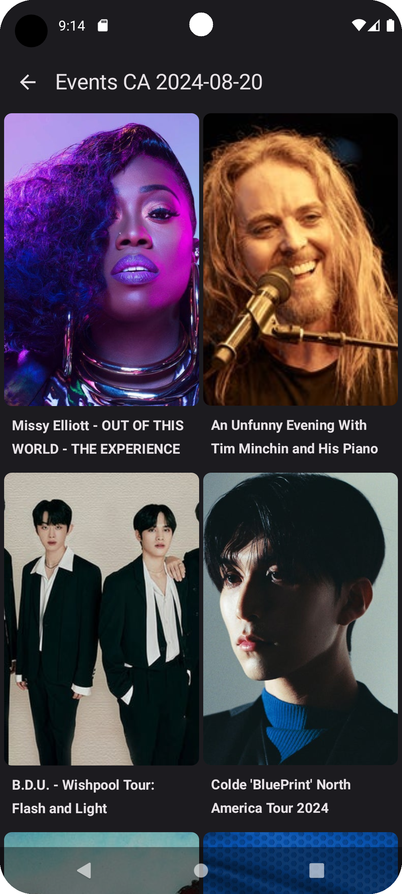

## __CALENDAR EVENTS__

### __ABOUT__

### App Made with Jetpack Compose, with the aim of using good practices, clean architecture

## __FEATURES__

* Calendar to select a date and see the events from the country selected

## __DEVELOPMENT__

* screens with compose
* ViewModel and data from api.
* ViewModel UI with StateFlow, navigation.
* repository, datasources, bd room. reactive ui.
* clean arquitecture

### __CALENDAR EVENTS SCREENSHOTS__

### Home With Spinner and Calendar

### Detail
